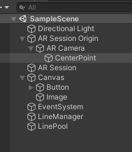

# AR공간에 선 긋기

버튼을 누르면 AR공간상에 선을 남기는 기능을 공부하였다.

사용한 오브젝트는 다음과 같다.



* Button - 버튼을 누르면 Line을 남기도록 한다.
* CenterPoint - Button을 눌렀을 때 Line을 생성하는 위치를 정해주는 Point이다.
                Z값을 0.2~1.0 만큼 지정하여 생성시 카메라 보다 앞에서 생성하도록 한다.
* LineManager - 라인생성/연장/중단 등 Line을 관리 하도록 여러 기능을 구현해 놓은 Object이다.
* LinePool - 라인이 생성되면 해당 풀에 등록되도록 한다.


## [LineRenderer]
3차원 공간에서 두 개 이상의 Position '배열'을 가져와서 각각의 Position 사이에 직선을 그리는 컴포넌트이다.
3차원 공간에 위치하는 라인을 그리기 위해 사용된다.

하나의 오브젝트에서 라인은 연속적이어야 하며, 두 개 이상의 분리된 선을 그리려는 경우는
두 개 이상의 오브젝트를 사용해야 한다.

### [Line 생성]

버튼을 누르면 이 LineRenderer로 Line Object를 만들어서 화면 상에 띄우도록 한다.

```C#
    public void StartDrawLine()
    {
        _use = true;           
        if (!_startLine)
        {
            MakeLineRendere();
        }
    }
```
* Line 생성은 Line 연장과 구별하기 위해 _startLine 변수를 이용하여
  버튼을 눌렀을 때 최초 1회에 한하여 MakeLineRendere()가 호출되도록 한다.

```C#
    public void MakeLineRendere()
    {
        GameObject tLine = Instantiate(_lineRenderePrefabs);    //Line Object생성 Line의 Prefab을 미리 public 변수에 저장해놓는다.
        tLine.transform.SetParent(_linePool);                   //Line이 생성되면 LinePool의 자식으로 등록한다.
        tLine.transform.position = Vector3.zero;                
        tLine.transform.localScale = new Vector3(1, 1, 1);      //position,Scale등 기본 설정

        _lineRendere = tLine.GetComponent<LineRenderer>();      //LineRenderer의 초기 설정
        _lineRendere.positionCount = 1;                         //Position은 1개를 저장해 놓는다. 
        _lineRendere.SetPosition(0, _pivotPoint.position);
        
        _lineRendere.startColor = _nowColor;
        _lineRendere.endColor = _nowColor;

        _startLine = true;                                      //변수를 이용하여 1회 실행하였음을 나타낸다.
        _lineList.Add(_lineRendere);

    }
```

### [Line 연장]

버튼을 누른 상태로 유지하면 Line이 계속해서 연장된다.

```C#
    void Update()
    {
        if (_use)
        {
            if (_startLine)
            {
                DrawLineContinue();
            }
        }
    }
```
* 버튼을 누르면 최초 1프레임에 한하여 호출되지 않는다.

```C#
    public void DrawLineContinue()
    {
        _lineRendere.positionCount = _lineRendere.positionCount + 1;
        _lineRendere.SetPosition(_lineRendere.positionCount - 1, _pivotPoint.position);
    }
```
* Position 배열을 늘려가면서 Line을 연장한다.

### [Line 연장 중단]

버튼을 누른 상태에서 떼면 Line 연장이 중단된다.

```C#
    public void StopDrawLine()
    {
        _use = false;
        _startLine = false;
        _lineRendere = null;
    }
```

* _use = false; 로 하여 DrawLineContinue() 가 더이상 호출되지 않도록 한다.
* _startLine = flase; 로 하여 다시 버튼을 누르면 MakeLineRendere()가 1회 호출되도록 한다.
* _lineRendere = null; 로 하여 기존에 그리고 있던 Line과 연동을 해제한다.


### [참고링크]
* https://www.youtube.com/watch?v=be1buuk-DKs (소스코드)
* https://docs.unity3d.com/kr/530/ScriptReference/LineRenderer.html (LineRenderer)
* https://docs.unity3d.com/kr/2020.3/Manual/class-LineRenderer.html (LineRenderer)